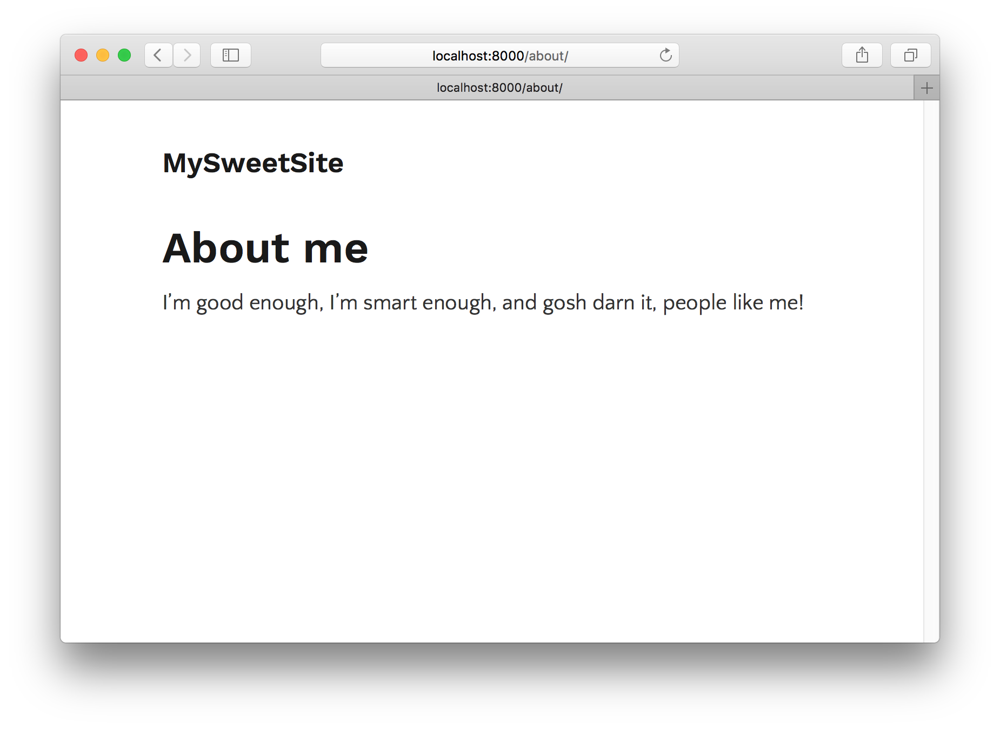

Welcome to part three!

## What's in this tutorial?

In this part, you'll learn about creating "layout" components. Layout components are for
sections of your site that you want to share across multiple pages. For example,
Gatsby sites will commonly have a layout component with a shared header and
footer. Other common things to add to layouts are a sidebar and/or navigation menu.

On this page for example, the header at the top is part of gatsbyjs.org's layout component.

Let's dive in and explore creating layouts.

## Install a starter

As we mentioned in Part Two, at this point it's probably a good idea to close the terminal window(s) and project files from previous parts of the tutorial, to keep things clean on your desktop. Then, open a new terminal window and run the following commands to create a new Gatsby site in a directory called `tutorial-part-three` and then move to this new directory:

```shell
gatsby new tutorial-part-three https://github.com/gatsbyjs/gatsby-starter-hello-world#v2
cd tutorial-part-three
```

Once the site is finished installing, install `gatsby-plugin-typography`. For a reminder of how to do this, see Part Two of the tutorials. For
the Typography.js theme, let's try the "Fairy Gates" typography theme this time:

```shell
npm install --save gatsby-plugin-typography react-typography typography typography-theme-fairy-gates
```

Create a `src/utils` directory, and then create the typography config file at `src/utils/typography.js`:

```javascript
import Typography from "typography"
import fairyGateTheme from "typography-theme-fairy-gates"

const typography = new Typography(fairyGateTheme)

export default typography
```

Then create your site's `gatsby-config.js` at the root of the site, and add the following code to it:

```javascript
module.exports = {
  plugins: [
    {
      resolve: `gatsby-plugin-typography`,
      options: {
        pathToConfigModule: `src/utils/typography.js`,
      },
    },
  ],
}
```

Now, let's add a few different pages: a front page, an about page, and a contact
page.

`src/pages/index.js`

```jsx
import React from "react"

export default () => (
  <div>
    <h1>Hi! I'm building a fake Gatsby site as part of a tutorial!</h1>
    <p>
      What do I like to do? Lots of course but definitely enjoy building
      websites.
    </p>
  </div>
)
```

`src/pages/about.js`

```jsx
import React from "react"

export default () => (
  <div>
    <h1>About me</h1>
    <p>I’m good enough, I’m smart enough, and gosh darn it, people like me!</p>
  </div>
)
```

`src/pages/contact.js`

```jsx
import React from "react"

export default () => (
  <div>
    <h1>I'd love to talk! Email me at the address below</h1>
    <p>
      <a href="mailto:me@example.com">me@example.com</a>
    </p>
  </div>
)
```


You now have the start of a nice personal site!

But there are a few problems. First, it'd be nice if the page content was
centered on the screen like in part two of the tutorial. And second, you should
really have some sort of global navigation so it's easy for visitors to find and
visit each of the sub-pages.

Let's tackle these problems by creating your first layout component.

## Your first layout component

First, create a new directory at `src/components`.

Now create a very basic layout component at `src/components/layout.js`:

```jsx
import React from "react"

export default ({ children }) => (
  <div style={{ margin: `0 auto`, maxWidth: 650, padding: `0 1rem` }}>
    {children}
  </div>
)
```

Now you need to import this new layout component into your page components.

Change `src/pages/index.js` to look like:

```jsx{2,5,11}
import React from "react"
import Layout from "../components/layout"

export default () => (
  <Layout>
    <h1>Hi! I'm building a fake Gatsby site as part of a tutorial!</h1>
    <p>
      What do I like to do? Lots of course but definitely enjoy
      building websites.
    </p>
  </Layout>
)
```


Sweet, the layout is working! Now, your text is centered and constrained to
a column 650 pixels wide, as you specified.

But try navigating to one of the other pages e.g. `/about/`. That page still
isn't centered. Try now importing and adding the layout component to `about.js` and
`contact.js`.

Let's now add to the layout component your site title:

```jsx{5}
import React from "react"

export default ({ children }) => (
  <div style={{ margin: `0 auto`, maxWidth: 650, padding: `0 1rem` }}>
    <h3>MySweetSite</h3>
    {children}
  </div>
)
```

If you go to any of your three pages you'll see the same title added e.g. the
`/about/` page:



Let's add navigation links to each of your three pages:

`src/components/layout.js`

```jsx{2-10,13-23}
import React from "react"
import { Link } from "gatsby"

const ListLink = props => (
  <li style={{ display: `inline-block`, marginRight: `1rem` }}>
    <Link to={props.to}>
      {props.children}
    </Link>
  </li>
)

export default ({ children }) => (
  <div style={{ margin: `0 auto`, maxWidth: 650, padding: `1.25rem 1rem` }}>
    <header style={{ marginBottom: `1.5rem` }}>
      <Link to="/" style={{ textShadow: `none`, backgroundImage: `none` }}>
        <h3 style={{ display: `inline` }}>MySweetSite</h3>
      </Link>
      <ul style={{ listStyle: `none`, float: `right` }}>
        <ListLink to="/">Home</ListLink>
        <ListLink to="/about/">About</ListLink>
        <ListLink to="/contact/">Contact</ListLink>
      </ul>
    </header>
    {children}
  </div>
)
```


And there you have it! A three page site with a basic global navigation.

_Challenge:_ With your new "layout component" powers, trying adding headers, footers,
global navigation, sidebars, etc. to your Gatsby sites!

## What's coming next?

Continue on to
[part four of the tutorial where you'll start learning about Gatsby's data layer and programmatic pages!](/tutorial/part-four/)
